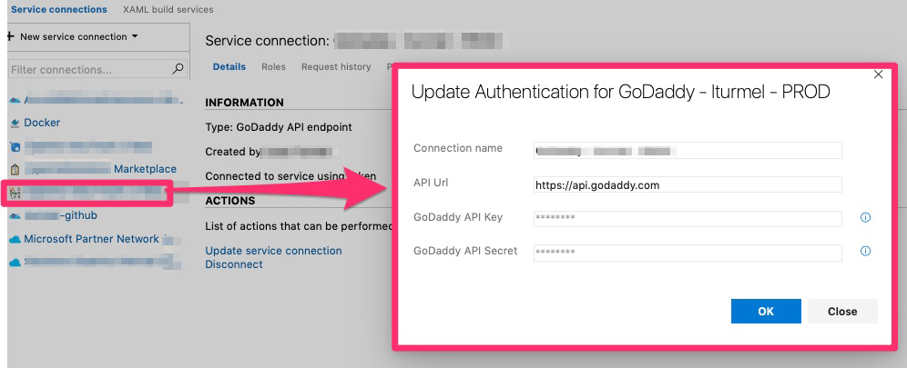
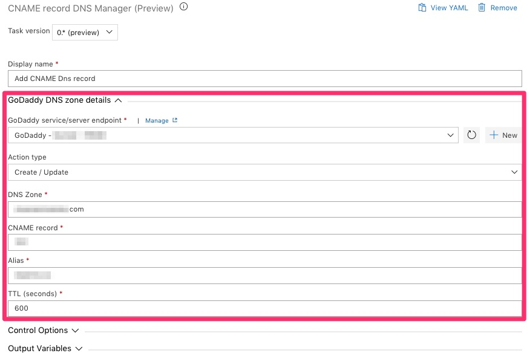

## Objective

Tasks packages to manage GoDaddy DNS Zone from Azure DevOps release pipeline.

Tasks provides:
- A Record Manager
- CName Record Manager

* Note: Due to some GoDaddy limitation, the delete functionnality only works properly if at least One DNS Records is existing on the desired record type.

This task package is compatible with:
- Hosted macOS build agent (supported)
- Hosted VS2017 (supported)
- Any private build agent with Powershell and Azure CLI installed

## Service Endpoint

## A Record Manager (required parameters)

## CNAME Record Manager (required parameters)

# Requirements

- Azure CLI must be installed on the build agent
